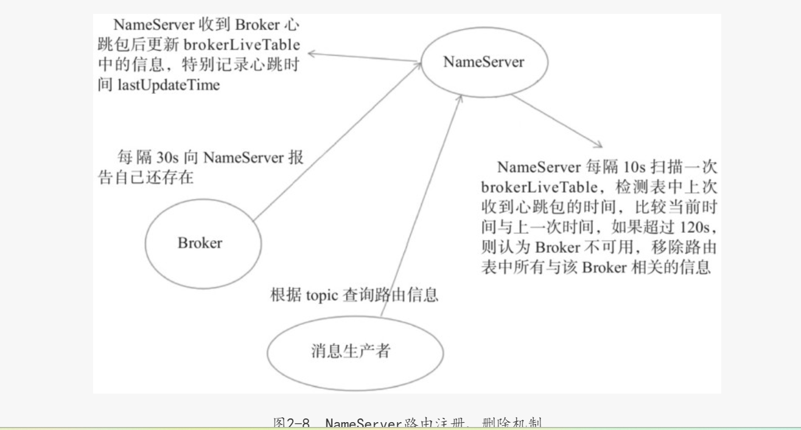
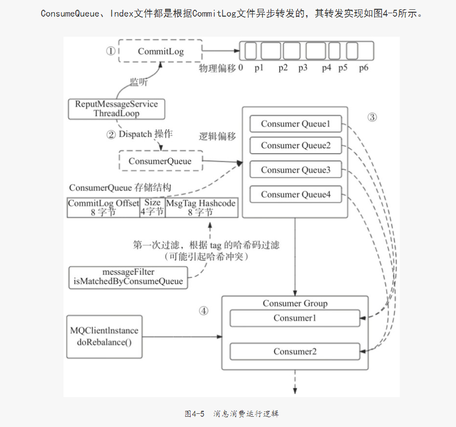

#NameServer 架构设计
Broker消息服务器在启动时向所有NameServer注册,消息生产者(Producer)在发送之前先从NameServer获取Broker服务器地址列表，让后根据负载算法从列表中选择一台消息服务器进行消息发送。
NameServer与每台Broker服务器保持长连接,并间隔30S检测Broker是否存活，如果检测到Broker宕机,则从路由注册表中将其移除。但路由变化不会马上通知消息生产者,这是为了降低NameServer实现的复杂性。
在消息发送端提供容错机制来保证消息发送的高可用性。

NameServer本身的高可用可通过部署多台NameServer服务器来实现，但彼此之间互不通信，也就是NameServer服务器之间在某一时刻的数据并不会完全相同，但这对消息发送不会造成任何影响，
这也是RocketMQ NameServer设计的一个亮点，RocketMQ NameServer设计追求简单高效

#NameServer的功能包括
NameServer 的功能包括：

提供路由信息： 当一个消息生产者或者消息消费者想要发送或接收特定主题的消息时，它们需要向 NameServer 查询该主题的路由信息，包括存储了该主题消息的 Broker 服务器地址等信息。

存储路由信息： NameServer 需要维护所有主题的路由信息，这些信息包括哪些 Broker 服务器存储了该主题的消息、分片信息、读写队列信息等。

管理 Broker 节点： NameServer 要能够管理 Broker 节点的注册与注销。当有新的 Broker 节点启动时，它会向 NameServer 注册自己的信息；当 Broker 节点下线时，也会通知 NameServer 进行注销。

负载均衡： NameServer 也可以帮助实现消息的负载均衡，确保消息在各个 Broker 之间均匀分布。

总的来说，NameServer 在消息中间件中扮演着类似 DNS 服务器的角色，为消息的生产者和消费者提供路由信息，同时负责管理 Broker 节点的注册与注销，以及路由信息的存储和更新。这些功能保证了消息的可靠传输和高效路由，是消息中间件系统中不可或缺的组成部分。

#NameServer路由注册、故障提测
NameServer主要作用是为消息生产者和消息消费者提供关于主题Topic的路由信息(存储该主体消息的Broker服务器地址)，那么NameServer需要存储路由的基础信息，还要能够管理Broker节点，包括路由注册、路由删除等功能.

#NameServer路由元信息
NameServer路由实现类：org.apache.rocketmq.namesrv.routeinfo.RouteInfoManager
NameServer存储以下信息
private final HashMap<String/＊ topic ＊/, List<QueueData>> topicQueueTable;
private final HashMap<String/＊ brokerName ＊/, BrokerData> brokerAddrTable;
private final HashMap<String/＊ clusterName ＊/, Set<String/＊ brokerName ＊/>>
clusterAddrTable;
private final HashMap<String/＊ brokerAddr ＊/, BrokerLiveInfo> brokerLiveTable;
private final HashMap<String/＊ brokerAddr ＊/, List<String>/＊ Filter Server ＊/>
filterServerTable;

#topicQueueTable:Topic消息队列路由信息，消息发送时根据路由表进行负载均衡。
其中：
外层的 Map 的键类型是 String，代表主题（topic）的名称。
外层的 Map 的值是一个内层的 Map，键类型同样是 String，代表队列的标识。
内层的 Map 的值是 QueueData 对象，用于存储关于队列的信息，比如队列的偏移量、最小/最大偏移量、读写队列等信息。
通过这种数据结构，RocketMQ 能够高效地存储和获取每个主题下的队列信息，包括读写队列、队列的偏移量等，从而实现消息的路由和负载均衡等功能。

综上所述，topicQueueTable 是 RocketMQ 中用于存储路由信息的重要数据结构，它承担着维护主题和队列之间关系的重要角色，确保消息在集群中的可靠传输和高效路由。

#读写队列和队列偏移量是与消息存储和消费相关的重要概念，它们解决了以下问题：

读写队列（Read Queue & Write Queue）：

作用： 读写队列是 RocketMQ 中用于存储消息的数据结构，每个主题下的队列会拥有自己的读队列和写队列。写队列用于存储生产者发送的消息，而读队列则用于消费者消费消息。
问题解决： 通过读写队列的设计，RocketMQ 实现了消息的异步写入和顺序消费。生产者可以将消息写入到写队列中，而消费者则按照顺序从读队列中读取消息，确保消息的有序性和可靠性。
队列偏移量（Queue Offset）：

作用： 队列偏移量表示消费者在某个队列中已经消费的消息位置。每个消费者在消费消息时，都会记录自己在每个队列中的消费进度，即队列偏移量。
问题解决： 通过队列偏移量，RocketMQ 能够实现消费者的消息拉取和消费进度的管理。消费者可以根据队列偏移量准确地从读队列中拉取消息，并且不会漏消费或重复消费消息，确保消息消费的准确性和完整性。
总的来说，读写队列和队列偏移量在 RocketMQ 中起着至关重要的作用：

读写队列解决了消息的存储和消费过程中的并发访问和顺序性问题，确保消息的有序写入和有序消费。
队列偏移量则帮助消费者记录和管理消费进度，避免消息消费的重复或遗漏，保证消息消费的正确性和完整性

#路由注册
RocketMQ路由注册是通过Broker与NameServer的心跳功能实现的。Broker启动时向集群中所有的NameServer发送心跳语句，每隔30s向集群中所有NameServer发送心跳包，NameServer收到Broker心跳包时会
更新brokerLiveTable缓存中BrokerLiveInfo的lastUpdate Timestamp，然后Name Server每隔10s扫描brokerLiveTable，如果连续120s没有收到心跳包，NameServer将移除该Broker的路由信息同时关闭Socket连接。

#设计亮点
NameServe与Broker保持长连接，Broker状态存储在brokerLiveTable中，NameServer每收到一个心跳包，将更新brokerLiveTable中关于Broker的状态信息以及路由表（topicQueueTable、brokerAddrTable、brokerLiveTable、filterServerTable）。
更新上述路由表（HashTable）使用了锁粒度较少的读写锁，允许多个消息发送者（Producer）并发读，保证消息发送时的高并发。但同一时刻NameServer只处理一个Broker心跳包，多个心跳包请求串行执行。这也是读写锁经典使用场景，更多关于读写锁的信息，可以参考笔者的博文：http://blog.csdn.net/prestigeding/article/details/53286756

#路由删除
根据上面章节的介绍，Broker每隔30s向NameServer发送一个心跳包，心跳包中包含BrokerId、Broker地址、Broker名称、Broker所属集群名称、Broker关联的FilterServer列表。但是如果Broker宕机，
NameServer无法收到心跳包，此时NameServer如何来剔除这些失效的Broker呢？Name Server会每隔10s扫描brokerLiveTable状态表，
如果BrokerLive的lastUpdateTimestamp的时间戳距当前时间超过120s，则认为Broker失效，移除该Broker，关闭与Broker连接，并同时更新topicQueueTable、brokerAddrTable、brokerLiveTable、filterServerTable。

RocktMQ有两个触发点来触发路由删除。1）NameServer定时扫描brokerLiveTable检测上次心跳包与当前系统时间的时间差，如果时间戳大于120s，则需要移除该Broker信息。
2）Broker在正常被关闭的情况下，会执行unregisterBroker指令。

#路由发现
RocketMQ路由发现（例如生产者根据topic查询路由信息）是非实时的，当Topic路由出现变化后，NameServer不主动推送给客户端，而是由客户端定时拉取主题最新的路由。
根据主题名称拉取路由信息的命令编码为：GET_ROUTEINTO_BY_TOPIC。RocketMQ路由结果如图2-6所示。

orderTopicConf：顺序消息配置内容，来自于kvConfig。
□ List<QueueData> queueData:topic队列元数据。
□ List<BrokerData> brokerDatas:topic分布的broker元数据。
□ HashMap<String/* brokerAdress*/, List<String>/*filterServer*/>:broker上过滤服务器地址列表。
□ NameServer路由发现实现类：DefaultRequestProcessor#getRouteInfoByTopic，如代码清单2-22所.

设计存在疑问:
NameServer需要等Broker失效至少120s才能将该Broker从路由表中移除,如果在Broker故障期间,消息生产者根据主体获取到的路由消息包含已经宕机的broker,导致消息发送失败。
这种情况怎么办，消息发送不是高可用? 下一章mq消息发送章节解决

图NameServer路由数据、路由注册与发现机制。

#消息发送基本流程
1.消息长度验证 2.消息发送之前先获取主体的路由信息,才知道消息要发送到哪个Broker节点上。第一次发送消息时,本地没有缓存topic的路由信息,查询NameServer尝试获取,更新本地路由信息表,
并且消息生产者每隔30s从NameServer中更新路由表.

#异步消息发送
异步发送方式相比于同步发送方式,虽然消息发送端的发送性能会显著提高,但是为了降低消息服务器的负载压力,rocketmq对消息发送的异步消息进行了并发控制，通过参数clientAsyncSemaphoreValue
实现,默认为65535.异步消息发送虽然也可以通过 DefaultMqProducer#retryTimesWhenSendAsyncFailed属性来控制消息的发送重试次数,但是重试的调用入口是在收到服务端响应包时进行的。
如果出现网络异常、网络超时等情况将不会重试。

#批量消息发送
批量消息发送是将同一主体的多条消息一起打包发送到消息服务端,减少网络调用次数,提供网络传输效率。当然并不是在同一批次中发送的消息数量越多,性能就越好,判断依据是单条消息的长度，
如果单条消息内容比较长，则打包发送多条消息会影响其他线程发送消息的响应时间。并且单批次消息发送总长度不能超过Default MQProducer#maxMessageSize.批量发送消息要解决的是如何
将这些消息编码,以便服务端能够正确解码每条消息的内容。

#RocketMQ 消息发送system busy、broker busy原因分析与解决方案
https://mp.weixin.qq.com/s/N_ttVjBpqVUA0CGrOybNLA 

#rocketMq 消息存储
RocketMq存储的文件主要包括CommitLog文件、ConsumeQueue文件、Index文件。RocketMQ将所有主体的消息存储在同一个文件中，确保消息发送时按顺序写文件。
ConsumeQueue消息消费队列文件,每个消息主体包含多个消息消息队列。是CommitLog文件基于topic的索引文件。主要用于消费者根据topic消费消息。其组织方式为/topic/queue,
同一个队列中存在多个消息文件。
ConsumeQueue 每个条目长度固定,8字节CommitLog 物理偏移量、4字节消息长度、8字节tag哈希码。这里不是存储tag的原始字符串,而是存储哈希码，目的是确保每个条目的长度固定,可以使用类似数组下标的方式快速定位条目，极大的提高了ConsumeQueue文件的读取性能。消息消费者根据topic、消息消费进度(ConsumeQueue逻辑偏移量)，即第几个ConsumeQueue条目，这样的消费进度去访问消息，通过逻辑偏移量logicOffsetX20,既可以找到该条目的起始偏移量（ConsumeQueue文件中的偏移量）,然后读取该偏移量后20个字节即可得到一个条目,无须遍历ConsumeQueue文件。

#ConsumeQueue 对上述条目解释
在ConsumeQueue文件中，每个条目指的是存储在文件中的一条消息消费队列的记录。这条记录包含了消息的关键信息，如CommitLog物理偏移量、消息长度和Tag哈希码。这些信息组成了一个完整的条目，用于标识和定位消息在消息队列中的位置。

举一个例子来解释每个条目的含义：
假设有一条消息存储在ConsumeQueue文件中的一个条目中，该条目的结构如下：

CommitLog物理偏移量：1000 (8字节)
消息长度：200 (4字节)
Tag哈希码：123456789 (8字节)
那么这个条目在ConsumeQueue文件中就会占据固定长度的20个字节（8字节 + 4字节 + 8字节），用来存储以上信息。消息消费者可以通过逻辑偏移量（第几个ConsumeQueue条目）来快速定位到这个条目，读取其中的信息，然后根据CommitLog物理偏移量找到消息在CommitLog中的实际内容并进行消费。

这样，每个条目就代表了消息队列中的一条消息记录，包含了必要的信息以便消息消费者能够有效地消费消息，而不需要遍历整个ConsumeQueue文件。

# 在ConsumeQueue文件中，每个条目对应着消息队列（MQ）中的一条消息记录。条目的顺序就是ConsumeQueue的逻辑偏移量，也可以理解为消息在消息队列中的位置顺序
当消息生产者发送消息到消息队列时，消息会被存储在CommitLog中，并相应地在ConsumeQueue中创建条目来记录消息的相关信息，包括CommitLog物理偏移量、消息长度和Tag哈希码等。这些条目按照消息在消息队列中的顺序依次排列，构成了ConsumeQueue文件。

消息消费者可以通过逻辑偏移量（ConsumeQueue的条目顺序）来快速定位并读取特定消息，而不需要遍历整个消息队列。通过逻辑偏移量乘以固定长度（例如20个字节）即可找到对应的条目，然后根据条目中的信息去获取消息内容并进行消费。

#消息消费运行逻辑图

